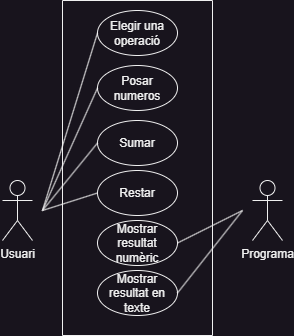
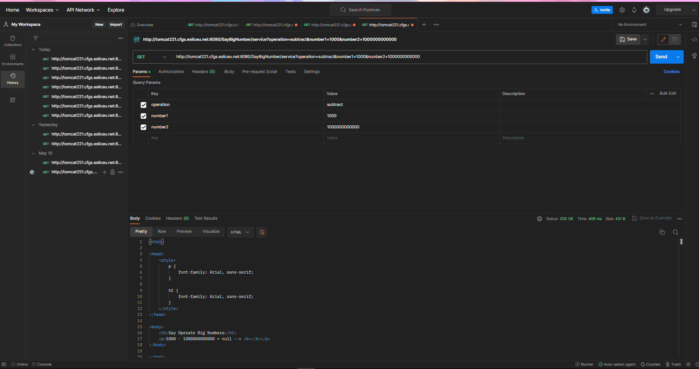
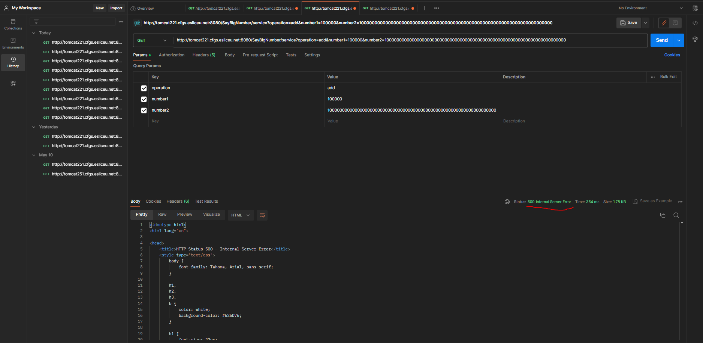

# PracticaEntornsGrupo

## Descripció del projecte

El nostre projecte está basat en un codi que varem fer en una practica de **Programació**, on farem calculs de números

ja sigui sumes o restes, on si a l'hora de sumar o restar hi ha que llevar ceros, es fará, pasarem aixó mateix

en una estructura de codi que ens han passat el professor on la modificarem perquè funcioni en un repositori

i desplega-ho en una pàgina web gràcies amb un servidor anomenat **Tomcat** on tindrem diverses pàgines desplegades o amb la

mateixa url on és pasará els valors i l'operador (sumar o restar) que volem fer l'operació, a part d'una conversió 

de lletres i a la vegada la inversa. 

## Piramide Unit Test
En el primer nivell cobrirem totes les unitats de test on serán les nostres proves per poder cubrir 

totes les cobertures o possibilitats que tenim en els tests, es a dir les limitacions dels números

introduïts en els parametres, els operadors que es poden calcular...

El segon nivell posarem a prova tests on agafarem els tests unitaris i fer "escenaris" 

per veure com s'afecten l'hora de l'usuari o del servei de la pàgina web

El tercer nivell aquí simularem aquesta càrrega fent que el nostre codi es prepari

a escala d'usuari, no del servei de la pàgina web, és a dir veure si simulant el

tràfic que es dispara des del navegador.

## Diagrames UML

### Diagrama de fluxe del client

### Diagrama d'estats del client

### Diagrama de seqüència del producte

### Diagrama de cas d'ús

## Pipeline

## Tomcat/Postman

* Test1
    
* Test2
    
* Test3
    
